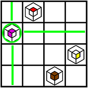
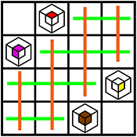
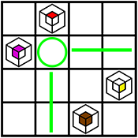

# About

Algemy is a logic game. "Light sources" are placed on the board in order to
illuminate a set of crystals. Each crystal must be set to a certain color, and
the entire board must be covered by light.

 - [Google Play](https://play.google.com/store/apps/details?id=com.KennyYoung.AlgemyGame)
 - [Apple App Store](https://itunes.apple.com/us/app/algemy/id1355522887?mt=8)

This project defines a solver of this game (which could be useful for [Puzzle
Hunt 19](https://puzzlehunt.research.microsoft.com/19/)).

# Progress

 - [x] Initial documentation
 - [x] Initial implementation (square board, simple mixing)
 - [ ] Expanded color mixing
 - [ ] Hexagonal board

In its current state, the solver should be able to solve anything in the first
two rows of the game.

# Dependencies

Tested working on Ubuntu 17.10.

```shell
# Python 2
sudo apt-get install python-pip
pip install ortools

# Python 3
sudo apt-get install python3-pip
pip3 install ortools
```

# Usage

Modify `algemy.py` with the board to be solved.

```shell
# Python 2
python algemy.py

# Python 3
python3 algemy.py
```

# Solving Methodology

## Background

Algemy can be modeled as a [Constraint Satisfaction Problem (CSP)](https://en.wikipedia.org/wiki/Constraint_satisfaction_problem).

Google provides a [CSP solver
library](https://developers.google.com/optimization/cp/cp_solver) as part of
its optimization tools which we use to implement this CSP problem. The Google
documentation has some educational material that's useful for understanding
these types of problems, such as the [N-queens
example](https://developers.google.com/optimization/cp/queens).

## Constraints

The CSP solver requires defining the problem as a set of constraints about
possible solutions.

Each empty square in a board is mapped to an integer variable that can either
be unset (0 value) or a light source (positive value, mapped from color).

We then define 3 categories of constraints on values these variables can take.


#### Crystal illumination

This constraint ensures each crystal is illuminated with the correct color.

This is actually the most complicated constraint to implement due to color
mixing rules.

We first look at all the cells in the sight-line for the crystal:



For each crystal on the board, we add a solver constraint according to the
mixing rules. For example, a crystal is illuminated RED when there exists at
last one source in the sight-line that is RED and there are none that are
YELLOW or BLUE. This particular rule is represented as follows in the solver:

```python
mixing_rules = {
    'R': [('+R', '-Y', '-B')],
}
```

#### At most one source per sight-line

This constraint ensures there are no placement conflicts.

We define a "sight-line" as a set of points on the board that cannot share two
light sources. In the following board, horizontal sight-lines are green,
vertical sight-lines are orange.



We loop through each sight-line in the board and add a solver constraint that
the sight-line has at most one value that is set. Note that there may be
sight-lines which contain no light sources in the final solution.

#### No empty squares

This constraint ensures the board is fully solved and there are no "blank
spaces".

Each square must either be a light source, or it must have a light source in
its "sight-lines".



A constraint is added to the solver for each empty square on the board.
